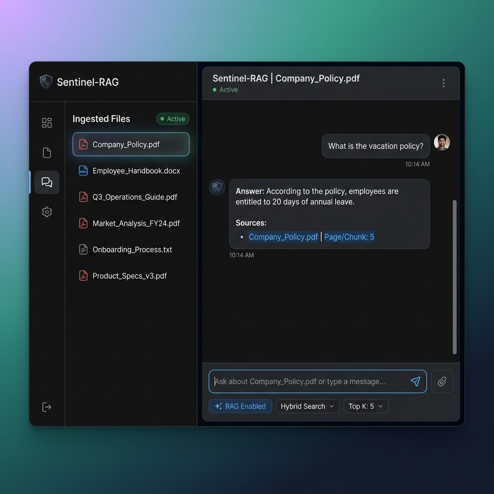
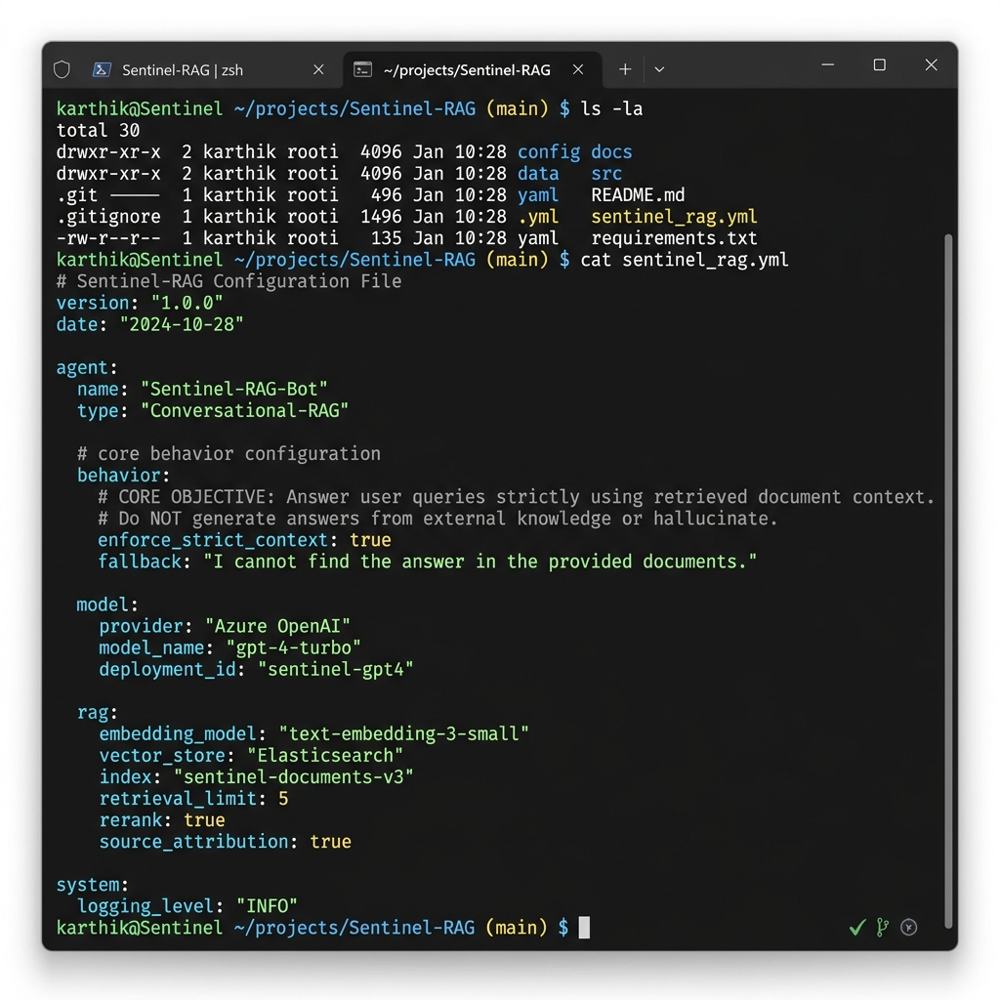

# Sentinel-RAG: Local-First Document Intelligence Agent

Sentinel-RAG is a high-performance, **local-first AI agent** designed for secure Retrieval-Augmented Generation (RAG). It enables users to interact with their private document repositories (PDFs, DOCs, notes) with the intelligence of Google Gemini, while ensuring total data sovereignty and offline operation.

---

## 📸 Visuals

### 1. Modern UI Interaction


### 2. Strict Configuration & Terminal Setup


---


## 🛡️ Core Objective
To provide a secure, private interface for document interaction where every answer is strictly grounded in the provided context, ensuring **zero hallucinations** and **complete traceability**.

## ✨ Key Features
- **Privacy-First**: Operates in a local-first environment. Your data stays on your machine.
- **Strict Grounding**: The agent ONLY uses provided document context to answer queries.
- **Zero Hallucination**: If the answer isn't in the documents, the agent will clearly state it doesn't know.
- **Traceable Citations**: Every response includes precise citations (Document Name | Page/Chunk).
- **Gemini Optimized**: Fully integrated with Google Gemini 3.0+ for high-quality reasoning and embedding.
- **Minimalist UI**: A clean, professional Gradio interface for seamless document ingestion and chat.

---

## 🛠️ Technology Stack
- **LLM**: Google Gemini (Gemini 2.0/3.0)
- **Framework**: LlamaIndex (Context Retrieval & Orchestration)
- **Backend**: FastAPI
- **UI**: Gradio
- **Vector Store**: Qdrant / Local File System
- **Language**: Python 3.11+

---

## 🚀 Getting Started

### 1. Prerequisites
- Python 3.11 installed
- A Google Gemini API Key

### 2. Installation
Clone the repository and install dependencies using Poetry:
```bash
# Install dependencies
poetry install --with ui,llms-gemini,embeddings-gemini
```

### 3. Configuration
The project uses a consolidated `settings.yaml` for all configurations.
1. Create or edit `settings.yaml` in the root directory.
2. Add your Gemini API Key:
```yaml
gemini:
  api_key: "YOUR_GOOGLE_API_KEY"
```

### 4. Running the Agent
Start the local server and UI:
```bash
python -m private_gpt
```
Once started, the UI will be available at `http://localhost:8001`.

---

## 📜 Strict Behavioral Rules
The agent is hardcoded with the following non-negotiable rules:
1. **Context Only**: Answers must be derived strictly from retrieved chunks.
2. **No Hallucinations**: Fabricating details is strictly forbidden.
3. **Mandatory Citations**: Sources must be cited for every fact provided.
4. **Professional Tone**: Responses are precise, minimal, and professional.
5. **Failure Mode**: If context is missing, the response defaults to: *"I don’t have enough information in the provided documents."*

---

## 📁 Project Structure
- `private_gpt/`: Core application logic.
- `private_gpt/ui/`: Gradio UI implementation.
- `private_gpt/server/`: FastAPI server and API routes.
- `settings.yaml`: Centralized configuration for LLM, Embeddings, and UI behavior.
- `scripts/`: Utility scripts for data ingestion and setup.

---

## ⚖️ License
This project is licensed under the MIT License. See the [LICENSE](LICENSE) file for details.

---
*Maintained by the Sentinel-RAG Team.*
